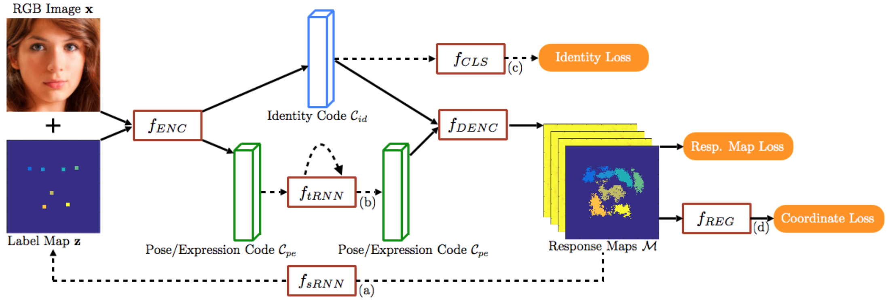
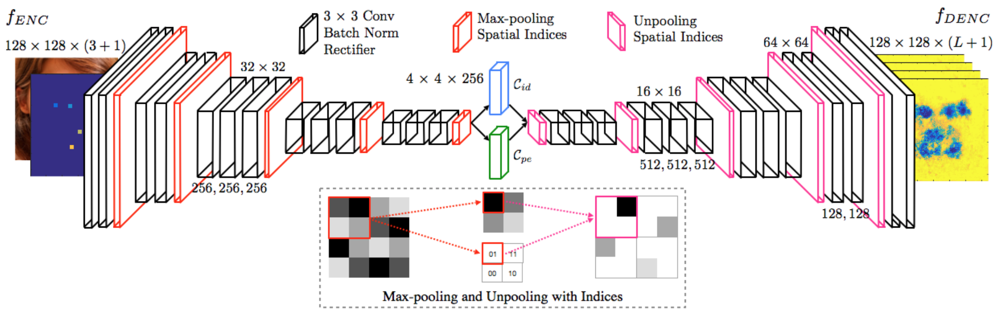

## A Recurrent Encoder-Decoder Network for Sequential Face Alignment
This is a quick demo for:

"A Recurrent Encoder-Decoder Network for Sequential Face Alignment"

Xi Peng, Rogerio S. Feris, Xiaoyu Wang, Dimitris N. Metaxas

European Conference on Computer Vision (ECCV), Amsterdam, 2016. (Oral)
[PDF](https://drive.google.com/file/d/0B-FLp_bljv_1c2h1azVzaXdCSDg/view) 
[Slides](https://drive.google.com/open?id=0B-FLp_bljv_1aXJMb0tXLXlpTFU) 
[Poster](https://drive.google.com/open?id=0B-FLp_bljv_1VHZkLTFMUGpqdEU)





## How to Track Landmarks in Video
1. Clone/Download the project to ```recurrent-face-alignment/```

2. Download folders ```model/``` and ```data/``` from [Google Drive](https://drive.google.com/open?id=0B-FLp_bljv_1dzZGdUZIamstVkE)

3. Copy folders ```model/``` and ```data/``` into ```recurrent-face-alignment/```

4. Edit ```TrackVideoDemo.py``` to set (a) ```path/to/caffe/python/```, and (b) ```video names to be tracked``` 

5. ```python TrackDemo.py```

6. Check tracking results in ```recurrent-face-alignment/result/```

## How to Detect Landmarks in Static Image

4. Edit ```DetectImageDemo.py``` to set (a) ```path/to/caffe/python/```, and (b) ```image folder to be detected``` 

5. ```python DetectImageDemo.py```


## Tracking protocol
For research convenience, we split video into frames using ffmpeg.

The tracker need the bbox of the face at the first frame for initialization. 

## Detection protocol
The detector need ```img_bbox.txt``` that each line has 5 tokens: ```path/to/image left top right bottom```.

```[left top right bottom]``` is the bbox of detected face.

## Dependency
caffe: any version that support batch normalization layer (such as [SegNet](https://github.com/alexgkendall/caffe-segnet)). We will relase our distributed caffe version soon.

python 2.7.

## Reference
```
@InProceedings{PengECCV16,
author = "Peng, Xi and Feris, Rogerio S.and Wang, Xiaoyu and Metaxas, Dimitris N.",
title = "A Recurrent Encoder-Decoder Network for Sequential Face Alignment",
booktitle = "European Conference on Computer Vision (ECCV)",
year = "2016",
pages="38--56"}
```
